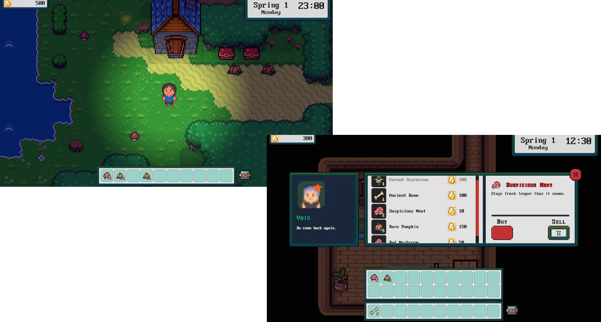

# Arcania Tales

A simple top-down 2D game, built with free assets. It is developed in C# using the Unity engine and contains various features useful in games.

## Game Features

* Player movement, input, and physics
* Customization and different animations for various body parts
* A camera following the player, confined inside the map
* Data that persist across scenes and scene fade-outs
* Day-Night cycle, world light, and passage of time
* An automatic flashlight and particle effects
* Hints notifying the player about the gameplay
* NPC daily schedules, A* pathfinding, and interactions with the player
* Items collected from the map and purchased or sold in shops
* Rearranging items in the toolbar, inventory, and in various chests across scenes